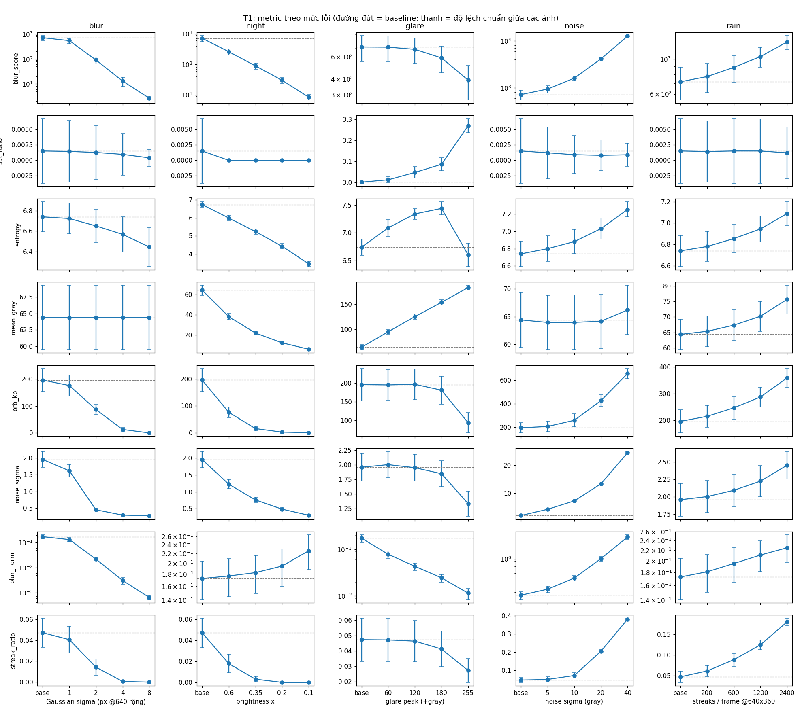
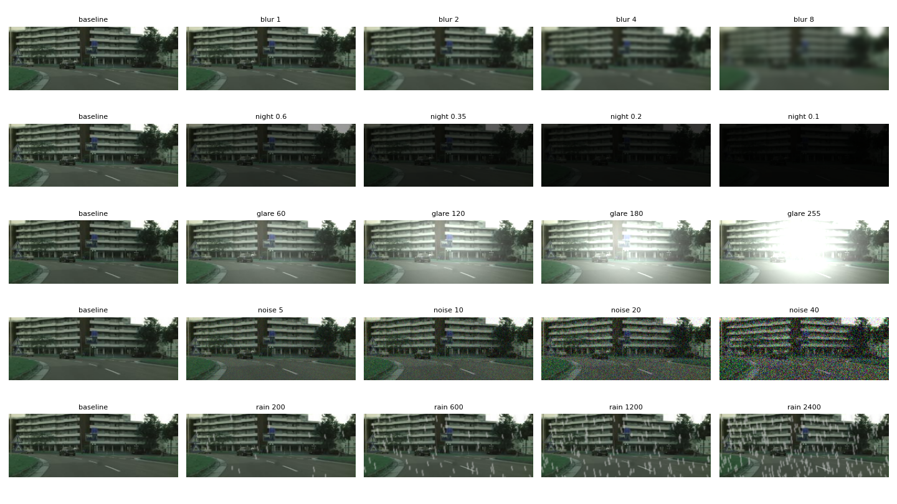

# Báo cáo cá nhân — Vai B: Dữ liệu & chạy benchmark

**Họ tên:** `Đồng Mạnh Hùng`  **MSSV:** `2A202602412`  **Nhóm:** `Ba chàng lính ngự lâm`  **Chủ đề:** T1 · Camera degradation health score (xe ADAS, camera)
**Repository chung:** `K4-Track4-Day04-TenNhom-Sensor-Reality-Sprint` · phiên bản/commit: `https://github.com/Hung23020370/K4-Track4-Day04-Bachanglinhngulam-Sensor-Reality-Sprint`

> Quy ước nhãn: **[Tự đo]** = số nhóm tự chạy và có trong `results/`; **[Nguồn]** = điều paper/repo nói; **[Giả thuyết]** = suy luận chưa đo.

## 1. Problem
- **Nền tảng / tính năng / sensor:** xe ADAS; tính năng là *giám sát sức khoẻ ảnh camera* để quyết định có giảm trọng số camera hay không; sensor là camera.
- **Failure case kiểm tra:** nhoè (blur), thiếu sáng (night), chói (glare), nhiễu cảm biến (noise), vệt mưa (rain).
- **Claim ban đầu:** trên cùng một ảnh, tăng mức blur/night/glare thì blur_score và số keypoint ORB giảm, glare làm sat_ratio tăng. Điều cần kiểm tra thêm: noise và rain có làm blur_score giảm như blur không.
- **Phần việc của tôi (vai B):** chuẩn bị dữ liệu ảnh thật, kiểm tra tham số lỗi, chạy và lưu bằng chứng benchmark, đối chiếu số giữa kết quả và ghi chú. `____` *(sửa lại đúng với việc bạn đã làm)*

## 2. Method
- **Nguồn đã chọn:** Dong và cộng sự, *Benchmarking Robustness of 3D Object Detection to Common Corruptions*, CVPR 2023 — https://openaccess.thecvf.com/content/CVPR2023/html/Dong_Benchmarking_Robustness_of_3D_Object_Detection_to_Common_Corruptions_CVPR_2023_paper.html · code: https://github.com/thu-ml/3D_Corruptions_AD (commit đã xem: `____`).
- **[Nguồn] (theo abstract):** paper thiết kế 27 loại corruption cho cả LiDAR và camera, tạo ba benchmark KITTI-C, nuScenes-C, Waymo-C và đánh giá 24 mô hình 3D detection; một kết luận là camera-only rất dễ tổn thương trước corruption ảnh. Input/output, metric chi tiết và limitation của nguồn: `____` *(điền sau khi đọc phần thân bài)*.
- **Nhóm tái hiện phần nào:** chỉ **ý tưởng** "tạo corruption có kiểm soát trên cùng dữ liệu"; không tái hiện số của paper và không chạy detector 3D.
- **Pipeline của nhóm:** ảnh BGR → tạo lỗi (`src/degrade.py`) → 5 metric (`src/metrics.py`) → bảng/plot/log (`src/run_benchmark.py`).
- **Metric (proxy, không phải mAP):** blur_score = phương sai Laplacian ảnh xám (cao = nét); sat_ratio = tỷ lệ pixel xám ≥ 250; entropy (bit) của histogram xám; mean_gray (0–255); orb_kp = số keypoint ORB.

## 3. Benchmark
**Dữ liệu.** 12 ảnh đường thật `data/images/train1..12.png`, kích thước 256×96 px. Nguồn và giấy phép: `____`. [Tự đo] baseline: blur_score 717,7; sat_ratio 0,0015; entropy 6,74; mean_gray 64,4; orb_kp 196.

**Cấu hình.** Mọi lỗi tạo từ cùng ảnh gốc, cùng hàm metric, seed cố định (seed 0).

| Lỗi | Tham số 4 mức | Metric chính |
|---|---|---|
| blur (Gaussian) | σ = 1, 2, 4, 8 px (chuẩn 640 px rộng) | blur_score, orb_kp |
| night | brightness ×0,6 / 0,35 / 0,2 / 0,1 | mean_gray, blur_score |
| glare | vầng sáng +60 / 120 / 180 / 255 mức xám | sat_ratio, entropy |
| noise | Gaussian σ = 5 / 10 / 20 / 40 mức xám | blur_score, entropy, orb_kp |
| rain | 200 / 600 / 1200 / 2400 vệt (chuẩn 640×360) | blur_score, orb_kp |

Luật cờ sức khoẻ: cờ blur nếu blur_score < 350,8 (0,5 × median baseline); cờ tối nếu mean_gray < 32,6; cờ chói nếu sat_ratio > 0,05. Ngưỡng hiệu chuẩn trên chính baseline (in-sample).

**Kết quả [Tự đo]** (trung bình 12 ảnh; cờ = tỷ lệ frame bị gắn cờ bởi luật tương ứng):

| Điều kiện | blur_score | mean_gray | sat_ratio | orb_kp | Cờ |
|---|---|---|---|---|---|
| baseline | 717,7 | 64,4 | 0,0015 | 196 | 0% |
| blur σ=1 / 2 / 4 / 8 | 547,8 / 91,0 / 12,9 / 2,6 | 64,4 | ≈ 0 | 176 / 87 / 13 / 0 | blur 8% / 100% / 100% / 100% |
| night ×0,6 / 0,35 / 0,2 / 0,1 | 259,9 / 89,4 / 30,1 / 8,4 | 38,3 / 22,1 / 12,4 / 6,1 | 0 | 76 / 15 / 2 / 0 | blur 83% / 100% / 100% / 100%; tối 0% / 100% / 100% / 100% |
| glare +60 / 120 / 180 / 255 | 715,1 / 686,7 / 587,4 / 391,6 | 95,3 / 125,6 / 154,1 / 183,6 | 0,013 / 0,048 / 0,087 / 0,270 | 195 / 197 / 181 / 94 | chói 0% / 42% / 83% / 100% |
| noise σ=5 / 10 / 20 / 40 | 942,8 / 1607 / 4127 / 12553 | ≈ 64 | ≈ 0 | 207 / 260 / 426 / 655 | **0% ở mọi mức** |
| rain 200 / 600 / 1200 / 2400 | 774,1 / 884,1 / 1035 / 1279 | 65,4 / 67,4 / 70,2 / 75,6 | ≈ 0 | 215 / 247 / 287 / 359 | **0% ở mọi mức** |

Bằng chứng: `results/summary.csv`, `results/flags.csv`, `results/metrics.csv` (từng ảnh), `results/trend.png`, `results/before_after.png`, `results/run.log`.




**Kiểm tra độ tin cậy của lần chạy [Tự đo]:**
- Chạy lại cùng lệnh trên 12 ảnh thật cho `metrics.csv` giống hệt bản đầu (tái lập được).
- Trên dữ liệu tổng hợp (cảnh `make_scene`), chạy với 3 seed khác nhau (100, 200, 300; 30 ảnh mỗi lần), noise σ=20 luôn làm blur_score tăng 23,2–24,0 lần so với baseline và luật cờ luôn gắn cờ 0%. Đây là kiểm tra trên dữ liệu tổng hợp, chưa lặp lại trên ảnh thật vì chỉ có 12 ảnh.
- Lỗi đã phát hiện và sửa: code ban đầu tự phóng ảnh về 640 px rộng; với ảnh 256×96 điều này làm sai metric. Hiện code giữ nguyên độ phân giải, và tham số blur/số vệt mưa co theo kích thước ảnh (σ thực áp dụng = σ × 0,4). Kết quả trên dữ liệu tổng hợp không đổi sau sửa.

## 4. Failure case
- **Điều kiện:** cùng 12 ảnh, thêm nhiễu Gaussian σ = 5–40 mức xám.
- **[Tự đo]:** blur_score tăng từ 717,7 lên 942,8 / 1607 / 4127 / 12553 (1,3 / 2,2 / 5,7 / 17,5 lần); orb_kp tăng từ 196 lên 207 / 260 / 426 / 655; luật cờ không gắn cờ frame nào, kể cả với vệt mưa. Nghĩa là trong phạm vi các metric này, ảnh nhiễu trông "nét hơn" ảnh gốc và hệ thống sẽ không giảm trọng số camera.
- **[Tự đo] quan sát phụ:** night ×0,6 bị cờ "nhoè" 83% trong khi cờ "tối" chưa bật; luật blur không phân biệt nhoè với thiếu sáng.
- **[Nguồn]:** paper cho biết camera-only model rất dễ tổn thương trước corruption ảnh. Kết luận này trên dataset và model của paper, không so trực tiếp được với số ở trên.
- **[Giả thuyết]:** Laplacian khuếch đại nhiễu tần số cao nên không tách được chi tiết thật khỏi nhiễu; nhiễu có thể khiến thuật toán dựa trên feature (VO/SLAM) nhận keypoint sai và detector giảm độ tin cậy. Nhóm chưa đo detector hay SLAM nên chưa kết luận.

## 5. Engineering decision
- **Quyết định đề xuất:** không dùng blur_score một mình làm health score. Bổ sung ước lượng nhiễu và chuẩn hoá theo độ sáng; khi cờ bật thì giảm trọng số camera trong fusion hoặc dựa nhiều hơn vào sensor khác (LiDAR/radar). Đây là đề xuất thiết kế, **chưa kiểm chứng**.
- **Trade-off:** luật đơn giản thì nhẹ và dễ giải thích nhưng bỏ sót nhiễu/mưa; thêm metric thì phát hiện được nhiều lỗi hơn nhưng có nguy cơ báo động giả và cần hiệu chuẩn ngưỡng theo cảnh/camera. Ngưỡng hiện hiệu chuẩn in-sample nên chưa dùng để kết luận cho cảnh khác.
- **Kiểm chứng vòng sau:** chạy lại `run_benchmark.py` với luật mới; kỳ vọng (chưa đạt) là tỷ lệ cờ ở noise σ ≥ 10 và rain ≥ 1200 tăng khỏi 0% trong khi baseline vẫn ≈ 0%.

## Limitation (liên quan phần B)
- Chỉ 12 ảnh rất nhỏ (256×96), không có ground truth, không chạy detector; kết quả chỉ nói về các metric proxy.
- Lỗi là mô phỏng đơn giản: blur Gaussian đều (không phải nhoè chuyển động), night chỉ nhân độ sáng (không thêm nhiễu), nhiễu thêm sau 8-bit, mưa là vệt thẳng. Noise σ = 20, 40 rất nặng so với camera thật; σ = 5, 10 thực tế hơn.
- Việc co tham số theo độ phân giải là lựa chọn của nhóm, không phải chuẩn của nguồn nào.
- Lần chạy ảnh thật mới có một cấu hình (seed 0); chưa đo độ biến thiên trên tập ảnh khác.

## Tái hiện
```bash
pip install -r requirements.txt
python src/run_benchmark.py --n 12      # ghi vào results/
python tools/check_numbers.py           # in lại các số trích dẫn để đối chiếu
```
Phiên bản thư viện: xem dòng đầu `results/run.log`.
